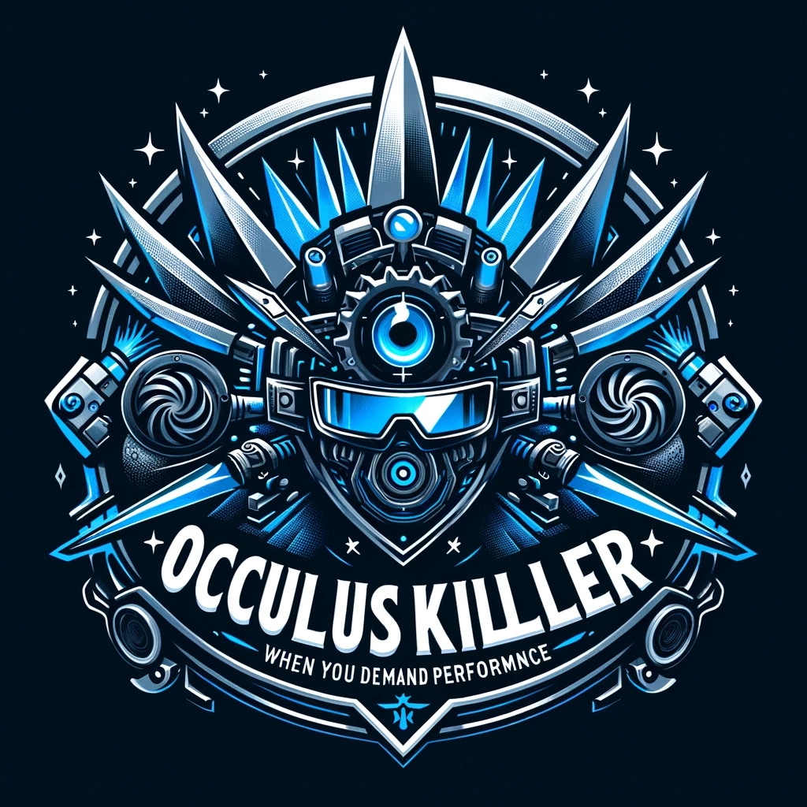

🛑 **Important Update on OculusKiller**

As the world of VR technology continues to evolve, so do our tools and methods for enhancing your virtual reality experience. With great pride in what OculusKiller has achieved, we announce a significant change:

🔗 **OculusKiller is No Longer Maintained**  
🌐 [Steam Link Now Available on the Oculus Store](https://www.meta.com/en-gb/experiences/5841245619310585/)

Steam Link represents a new chapter in VR gaming, streaming your favorite games directly from your Steam library to your Meta Quest headset. This powerful, intuitive solution offers a high-fidelity and seamless way to enjoy your games wirelessly, using the robust capabilities of your computer.

🌟 **Key Features of Steam Link:**
- **Seamless Integration:** Wirelessly connects to your computer on the same network with Steam running.
- **High-Quality Streaming:** Leverages your computer's power for a superior gaming experience.
- **Access to Steam Library:** Play, discuss, and explore your Steam games and desktop apps.

👉 **Getting Started:**
1. **Download Steam Link** onto your Meta Quest headset.
2. **Follow the Setup Guide** for wireless connection to your computer with Steam.

**Minimum System Requirements:**
- OS: Windows 10 or newer
- GPU: NVIDIA GTX970 or better
- Router: 5GHz, Wi-Fi 5
- Headset: Meta Quest 2, 3, or Pro

**Recommended Setup:**
- Processor: Intel Core i5-4590/AMD FX 8350 or better
- Memory: 16 GB RAM
- GPU: NVIDIA RTX2070 or better
- Internet: Broadband connection
- Router: Wi-Fi 6 or 6E
- Wired network connection for the computer

🙏 **A Heartfelt Thank You to Our Community**
The journey with OculusKiller has been nothing short of remarkable, thanks to your unwavering support and enthusiasm. As we pivot to embrace new technologies like Steam Link, we want to express our deepest gratitude to everyone who downloaded, used, and contributed to OculusKiller and its ReVamped edition.

Your engagement and feedback were the lifeblood of this project, driving us to innovate and improve continuously. We are immensely thankful to our dedicated team, contributors, and users for their invaluable input and support.

🗃 **Archiving the Repository**
While we step into this new phase, the OculusKiller repository will be archived but remain accessible for historical reference and any future needs. This marks not an end, but a transformation, as we continue to push the boundaries of virtual reality experiences.

🌟 **Thank You Again**
Your support has been the cornerstone of OculusKiller's success. We look forward to your continued engagement as we explore new horizons in VR technology.

With appreciation and excitement for the future,

**The Oculus Killer Team** 🚀

# Oculus Killer 🚀

Oculus Killer has evolved! Now more efficient and user-friendly, it focuses on enhancing your VR experience by terminating unnecessary Oculus processes and seamlessly launching SteamVR. This latest version is a leap forward, featuring a modular design, smoother and faster performance, and an advanced logging system for better error tracking and process monitoring.

**Original Author:** [@kaitlyndotmoe](https://github.com/kaitlyndotmoe)  
**Contributors:** @UnusualNorm, @HyrumGG  
**Original Repository:** [OculusKiller](https://github.com/kaitlyndotmoe/OculusKiller)

This tool is a perfect companion to the [Oculus VR Dash Manager](https://github.com/DevOculus-Meta-Quest/Oculus-VR-Dash-Manager), ensuring a comprehensive and optimized VR experience.

## 🚩 Index
- [Features](#-features)
- [Download](#-download-)
- [Installation](#-installation)
- [Common Fixes](#-common-fixes)
- [Support](#-support-oculus-killer)
- [Changelog](Changelog.md)
- [Logging](#-logging)
- [Acknowledgements](#-acknowledgements)

## 🌟 Features
- Modular Design for Enhanced Flexibility
- Improved Performance for a Smoother Experience
- Advanced Error Handling for Reliability
- Real-Time Process Monitoring
- Graceful Exit Detection for SteamVR
- Efficient Logging System with Log Rotation

## ⬇️ Download ⬇️

Grab the latest release [here](https://github.com/DevOculus-Meta-Quest/OculusKiller/releases).

  
  
  
  
  
  

## 📜 Logging
- **Log Location:** All log files are located at `C:\Users\<USERNAME>\AppData\Local\OculusKiller\OculusKiller.log`.
- **Log Rotation:** To ensure efficiency and manageability, Oculus Killer implements a log rotation system. This means older logs are archived periodically, keeping the active log file fresh and concise.
- **Error and Process Monitoring:** The logging system meticulously records all significant events, errors, and process activities. This allows for easy troubleshooting and understanding of the application's behavior.
- **Reading Logs:** You can view the logs using any text editor. They provide detailed insights into the application's operations, including any issues encountered and actions taken by the software.

## 🚀 Support Oculus Killer
🚀 [Support Us with a Donation](https://www.paypal.com/donate/?business=X76ZW4RHA6T9C&no_recurring=0&item_name=Support+the+evolution+of+Oculus+VR+Dash+Manager%21+Your+donation+fuels+innovation+and+enhanced+virtual+experiences.+%F0%9F%9A%80%F0%9F%8C%90&currency_code=USD)

Every contribution, no matter the size, makes a monumental difference. Thank you for believing in Oculus Killer and for being an integral part of our community. Together, we're not just playing games; we're setting new standards for virtual reality.

With gratitude,

The Oculus Killer Team 🌟

## 🔄 Recent Updates
- **Removed Auto-Restart:** We've removed the automatic restart function due to its potential to cause issues. Oculus Killer now focuses on efficiently terminating processes and monitoring for a more stable experience.
- **Enhanced Exit Detection:** The process monitoring has been refined to better detect when users exit SteamVR, ensuring a more responsive and accurate shutdown of unnecessary processes.
- **Advanced Logging:** The logging system has been upgraded for more detailed and informative logs, making it easier to track the application's performance and troubleshoot any issues.

## 🛠 Installation
1. Open Task Manager, go to Services and look for OVRService, right click on it and stop it. (If you have the Oculus app or any VR games open, they WILL close when stopping OVRService.)
2. Go to `C:\Program Files\Oculus\Support\oculus-dash\dash\bin` in Explorer.
3. Rename the original `OculusDash.exe` to `OculusDash.exe.bak` and move my replacement `OculusDash.exe` into the folder you just opened in Explorer.
4. Go back to Task Manager, look for OVRService again, right click on it and start it.

## 🛠 Common Fixes
### Headset Infinitely Loads (SteamVR doesn't launch)
- Open "File Explorer"
- Click the "View" tab (at the top)
- Enable "File name extensions"
- Follow the installation instructions

## 🙏 Acknowledgements
We extend our heartfelt gratitude to everyone who has contributed to the development and evolution of Oculus Killer. This project is not just a product of our team's hard work but also a reflection of the invaluable support and feedback from our user community.

**Special Thanks:**
- **[@kaitlyndotmoe](https://github.com/kaitlyndotmoe):** For initiating this project and laying the foundation for what Oculus Killer has become today.
- **Community Contributors:** To all the developers, testers, and users who have contributed their time, skills, and insights to improve Oculus Killer. Your pull requests, bug reports, and suggestions have been instrumental in shaping this tool.
- **Oculus VR Dash Manager Team:** For their collaboration and support, which has been crucial in ensuring compatibility and enhancing the overall VR experience.
- **Our Users:** To every individual who has downloaded, used, and provided feedback on Oculus Killer. Your engagement and enthusiasm keep us motivated and focused on continuous improvement.

**Donors and Supporters:**
- We are immensely thankful to those who have supported us through donations. Your generosity helps us keep the project alive and thriving.

**Family and Friends:**
- A special mention to our families and friends for their understanding, encouragement, and patience. Balancing development time with personal life is a challenge, and your support makes it all possible.

As we continue to develop Oculus Killer, we remain committed to our community's needs and aspirations. Your ongoing support and feedback are the driving forces behind our innovation and dedication.

Thank you for being a part of our journey. Together, we are not just enhancing a tool; we are shaping the future of virtual reality experiences.

**The Oculus Killer Team** 🚀

---

Oculus Killer continues to evolve, driven by community feedback and a commitment to enhancing your VR experience. Stay tuned for more updates and improvements! 🌟
