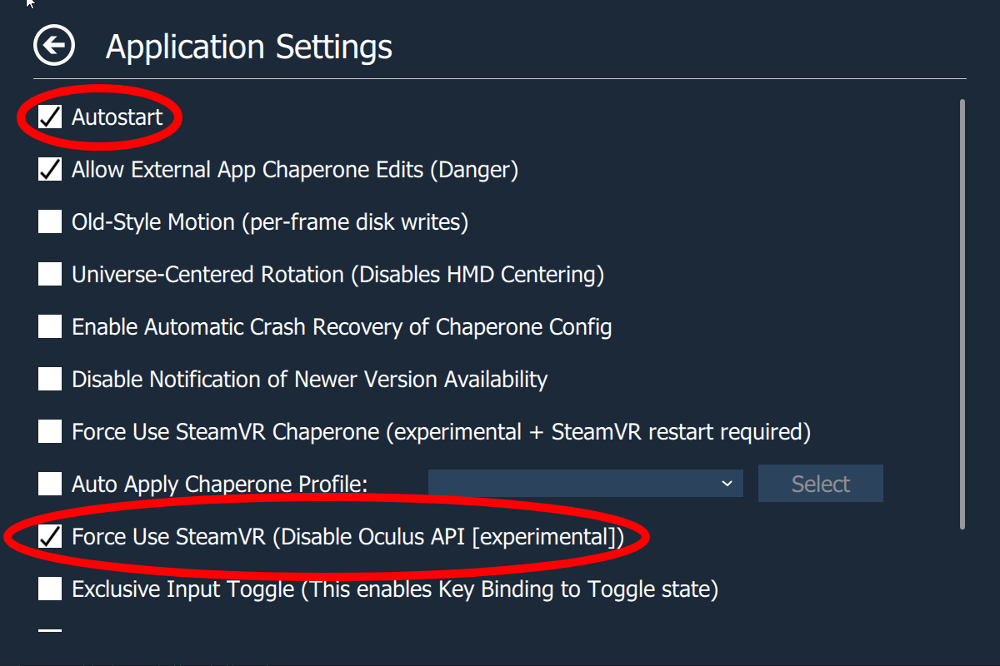

# Oculus Killer

Revamped and supercharged to enhance your VR experience by terminating unnecessary Oculus processes and seamlessly launching SteamVR. This refactored version is modular, smoother, faster, and equipped with improved error handling, crash monitors, and automatic restart capabilities in case of a crash.

**Original Author:** [@kaitlyndotmoe](https://github.com/kaitlyndotmoe)  
**Contributors:** @UnusualNorm, @HyrumGG  
**Original Repository:** [OculusKiller](https://github.com/kaitlyndotmoe/OculusKiller)

This tool complements the [Oculus VR Dash Manager](https://github.com/DevOculus-Meta-Quest/Oculus-VR-Dash-Manager), ensuring that you have comprehensive control and optimization of your VR experience.

## Index
- [Features](#features)
- [Installation](#installation)
- [Common Fixes](#common-fixes)
- [Changelog](Changelog.md)

## Features
- Modular Design
- Enhanced Performance
- Improved Error Handling
- Crash Monitoring
- Automatic Restart on Crash
- Graceful Exit when Leaving SteamVR

## ⬇️ Download ⬇️

Grab the latest release [here](https://github.com/DevOculus-Meta-Quest/OculusKiller/releases).

  
  
  
  
  
  

## Installation
- Open Task Manager, go to Services and look for OVRService, right click on it and stop it. (If you have the Oculus app or any VR games open, they WILL close when stopping OVRService.)
- Go to `C:\Program Files\Oculus\Support\oculus-dash\dash\bin` in Explorer.
- Rename the original `OculusDash.exe` to `OculusDash.exe.bak` and move my replacement `OculusDash.exe` into the folder you just opened in Explorer.
- Go back to Task Manager, look for OVRService again, right click on it and start it.

## Common Fixes
### Headset Infinitely Loads (SteamVR doesn't launch)
- Open "File Explorer"
- Click the "View" tab (at the top)
- Enable "File name extensions"
- Follow the installation instructions

You can verify that you installed it successfully if "OculusDash.exe.bak" is the "BAK File" type.

### OpenXR Games launch, but cannot be seen
- Open SteamVR settings (with headset connected)
- Press "Show" under "Advanced Settings"
- Open the "Developer" tab
- Click "Set SteamVR as OpenXR runtime"

### Non-OpenXR Games launch, but cannot be seen
- Install [OVR Advanced Settings](https://store.steampowered.com/app/1009850/OVR_Advanced_Settings/) and launch it.
- Open the new overlay (found next to the desktop button)
- Open the overlay settings (bottom left)
- Turn on "Autostart"
- Turn on "Force Use SteamVR (Disable Oculus API [experimental])"

**Logs:** All log files are located at `C:\Users\<USERNAME>\AppData\Local\OculusKiller\OculusKiller.log`
